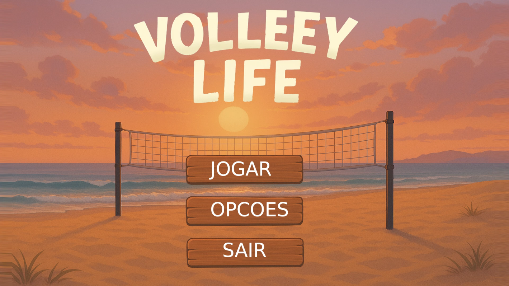
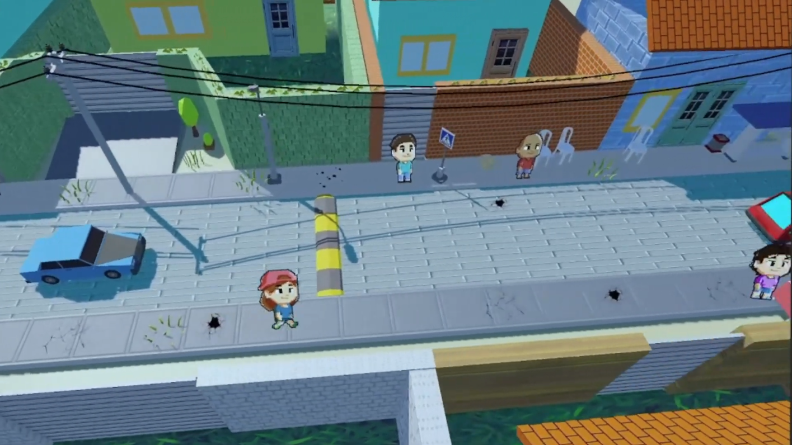
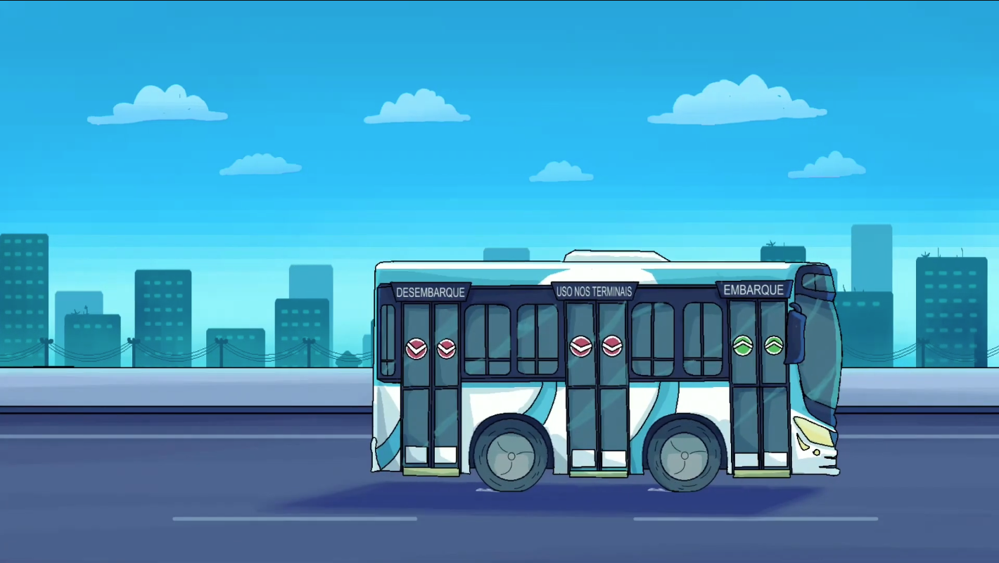
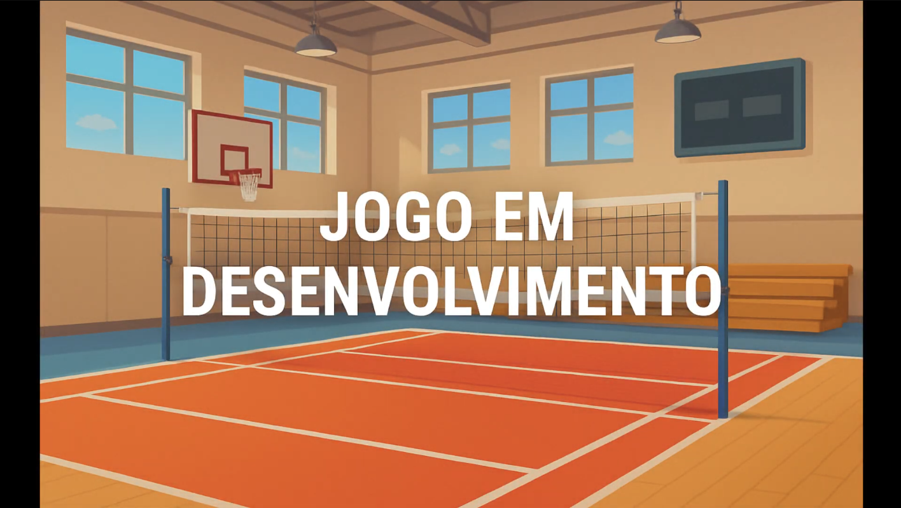
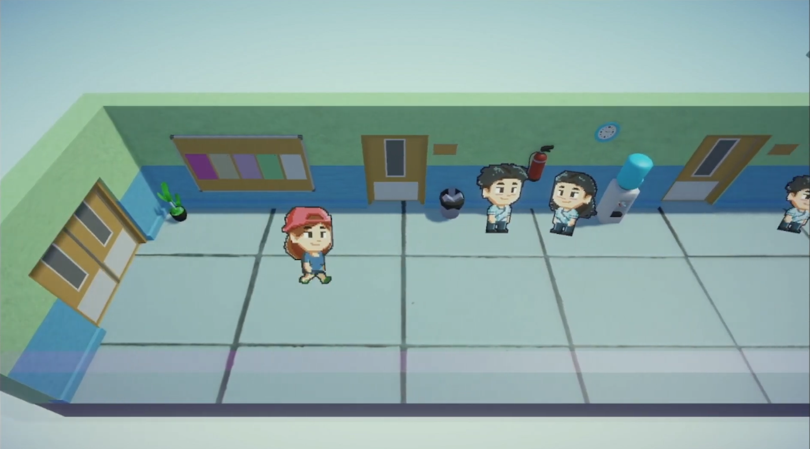
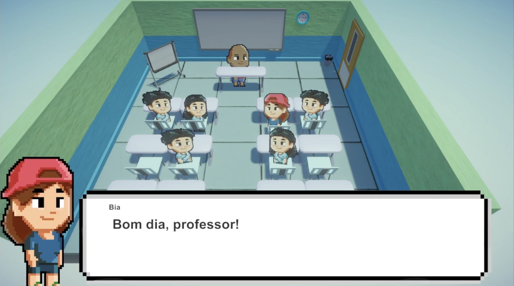
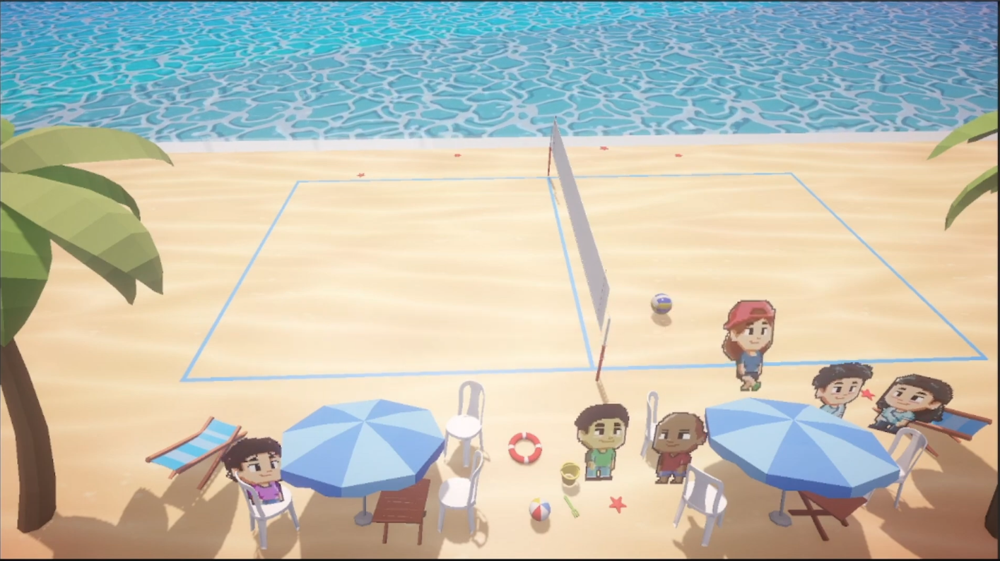
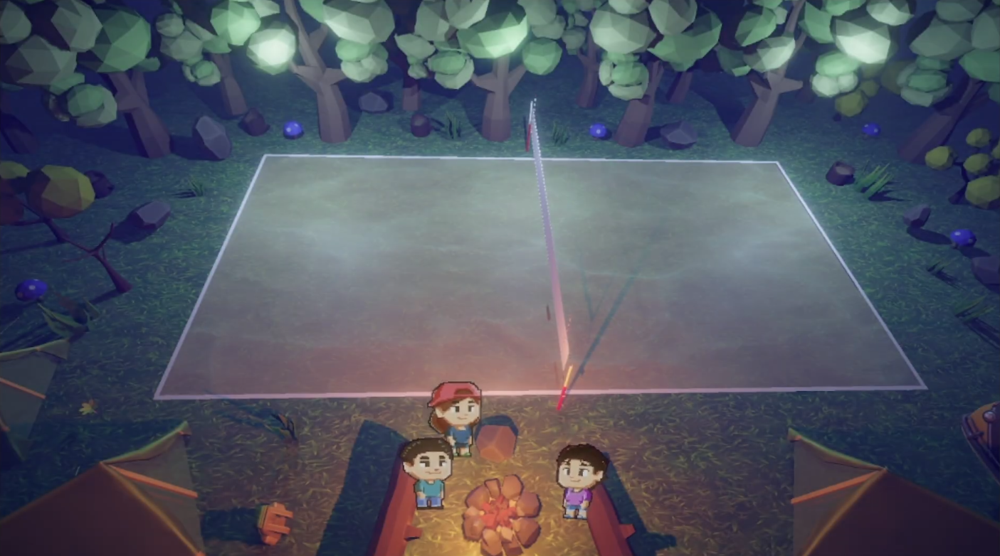
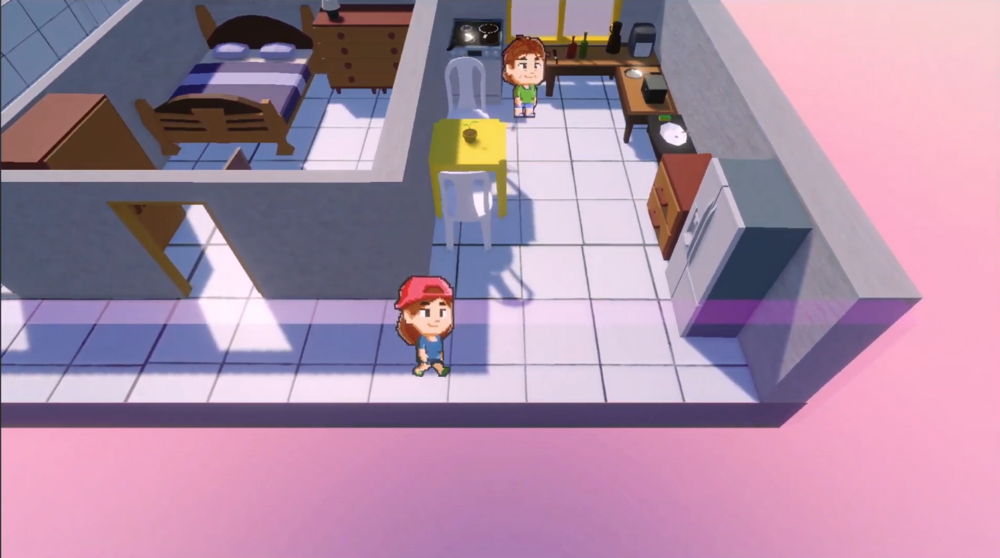

# 🏐 Volley Life: Rumo ao Topo

> *Equilibre as aulas, o trabalho nos quiosques da praia e os treinos intensos para se tornar a próxima estrela do vôlei brasileiro.*

---

### 📸 Galeria de fotos e Gameplay
> **💡 Dica:** Clique na primeira imagem (ícone de vídeo) para assistir ao trailer do jogo!
| 

| 🎬 *ASSISTIR GAMEPLAY* | 🏫 *Vida Escolar** | 🏖️ *Praia e Lazer* |
|:---:|:---:|:---:|
 |  |  |  |
| *🌆 Cidade e Locais* | *🥥 Minigames (Trabalho)* | *🏐 Treino de Vôlei* |
|  |  |  |
| *📈 Atributos e RPG* | *📚 Estudo e Carreira* | 
|  |  | 

## 📖 Sobre o Projeto

**Volley Life** é um simulador de vida (Life Sim) ambientado em uma cidade litorânea brasileira. O jogador assume o papel de um jovem que sonha em ser profissional de vôlei, mas precisa enfrentar os dilemas reais do cotidiano.

O jogo foca no equilíbrio de **Gerenciamento de Tempo** e **Habilidade Motora**. Você precisa estudar para passar de ano, trabalhar para comprar novos tênis e treinar exaustivamente para vencer os campeonatos regionais.

---

## 🕹️ Mecânicas e Gameplay

O jogo alterna entre dois estilos principais:

### 🏙️ Vida Cotidiana e Minigames
* **Exploração Urbana:** Vá à escola, visite a praia ou passeie pelo centro da cidade.
* **Sistema de Economia:** Jogue minigames como "Vendedor de Água de Coco" ou "Entregador" para ganhar dinheiro.
* **Status do Atleta:** Gerencie sua energia, fome e nível de estudo. Se não estudar, você fica fora dos jogos!

### 🏐 Partidas de Vôlei
* **Física Realista:** Sistema de física aplicado à bola para recepções, levantamentos e ataques precisos.
* **Progressão de RPG:** Melhore seus atributos de força, salto, velocidade e defesa conforme treina na academia ou na areia.
* **Ambientação:** Quadras que variam de ginásios escolares a arenas de vôlei de praia lotadas.

---

## 🛠️ Tecnologias e Ferramentas

| Categoria | Ferramenta | Uso |
| :--- | :--- | :--- |
| **Engine** |  | Desenvolvimento de sistemas e física |
| **Modelagem 3D** | **Blender** | Criação dos cenários brasileiros |
| **Modelagem personagems** | **aseprite** | Criação de sprites de personagem originais e animacoes |
| **Programação** | **C#** | Lógica de jogo e IA dos oponentes |
| **Áudio** | **Audacity** | Efeitos sonoros e trilha sonora ambiente |
| **Versionamento**|  | Controle de versão e colaboração |

---

## 👨‍💻 Desenvolvedores

* **kaynan santos** 
* **ana beatriz duarte** 

---

## 📄 Licença

Este projeto é desenvolvido para fins [Educacionais/Portfolio]. Todos os direitos reservados.
